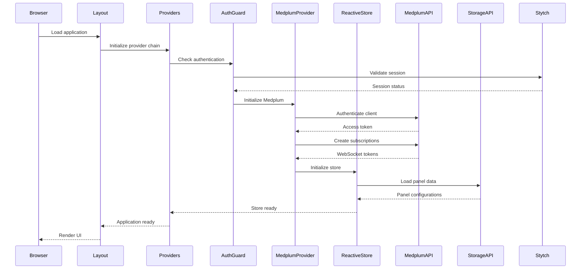
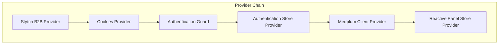

# Application Startup Flow

The application startup flow is the foundation upon which all other data flows depend. When the application first loads, it must establish authentication, initialize data connections, and prepare the reactive state management system. Understanding this flow is essential for debugging startup issues and optimizing application performance.

## Startup Sequence Overview

The startup flow follows a carefully orchestrated sequence that ensures dependencies are satisfied before proceeding to the next step:

## Provider Chain Initialization

The application uses a provider pattern to establish context and manage dependencies. Each provider in the chain must initialize before the next can proceed:

### Provider Hierarchy

### Initialization Order

1. **Stytch Provider**: Initializes the authentication client
2. **Cookies Provider**: Sets up session management
3. **Authentication Guard**: Validates user session
4. **Authentication Store**: Manages user state
5. **Medplum Provider**: Establishes data connections
6. **Reactive Store Provider**: Initializes state management

## Authentication Setup

Authentication is the first critical step in the startup sequence. The system must verify the user's identity before establishing any data connections.

### Session Validation Process

The authentication guard performs several checks:

1. **Session Token Check**: Validates the Stytch session token
2. **Cookie Validation**: Ensures authentication cookies are present
3. **Redirect Handling**: Manages login redirects when sessions expire
4. **Multi-tab Coordination**: Prevents authentication conflicts across tabs

### Authentication States

The application handles several authentication states:

- **Loading**: Validating session
- **Authenticated**: User is logged in and authorized
- **Unauthenticated**: User needs to log in
- **Expired**: Session has expired, redirect to login

## Medplum Client Initialization

Once authentication is established, the application initializes the Medplum client to connect to the healthcare data system.

### Client Setup Process

1. **Configuration Loading**: Retrieves Medplum connection settings
2. **Token Management**: Handles authentication tokens and refresh
3. **Multi-tab Coordination**: Shares authentication across browser tabs
4. **Error Recovery**: Handles connection failures gracefully

### Connection Optimization

The Medplum client uses several optimization strategies:

- **Token Caching**: Stores authentication tokens in localStorage
- **Connection Pooling**: Reuses connections when possible
- **Retry Logic**: Automatically retries failed connections
- **Graceful Degradation**: Continues operation when Medplum is unavailable

## Reactive Store Initialization

The reactive store system manages application state and coordinates updates across components.

### Store Setup Process

1. **Storage Adapter Selection**: Chooses between local and API storage
2. **Initial Data Loading**: Retrieves panel configurations
3. **Subscription Setup**: Establishes reactive update mechanisms
4. **State Synchronization**: Ensures consistency across components

### Storage Modes

The system supports multiple storage modes:

- **Local Storage**: For development and offline scenarios
- **API Storage**: For production with backend persistence
- **Hybrid Mode**: Combines local caching with API persistence

## WebSocket Connection Setup

Real-time updates require establishing WebSocket connections to Medplum.

### Subscription Creation

The system creates FHIR subscriptions for:

- **Patient Resources**: For patient data updates
- **Task Resources**: For task status changes
- **Custom Resources**: For application-specific data

### Connection Management

WebSocket connections are managed with:

- **Automatic Reconnection**: Handles connection drops
- **Heartbeat Monitoring**: Detects stale connections
- **Error Handling**: Graceful degradation on connection failures
- **Multi-tab Coordination**: Shares connections across tabs

## Error Handling and Recovery

The startup flow includes comprehensive error handling to ensure the application remains usable even when external services fail.

### Error Categories

- **Authentication Errors**: Session validation failures
- **Connection Errors**: Network or service unavailability
- **Configuration Errors**: Missing or invalid settings
- **Data Loading Errors**: Storage or API failures

### Recovery Strategies

- **Retry Logic**: Automatic retry with exponential backoff
- **Fallback Modes**: Degraded operation when services are unavailable
- **User Notification**: Clear error messages and recovery guidance
- **Graceful Degradation**: Continue operation with limited functionality

## Performance Optimization

The startup flow is optimized for speed and reliability:

### Loading Optimizations

- **Parallel Initialization**: Independent providers initialize simultaneously
- **Lazy Loading**: Non-critical components load after startup
- **Caching Strategy**: Intelligent caching of configuration and data
- **Resource Preloading**: Anticipate and preload required resources

### Monitoring and Metrics

The system tracks startup performance:

- **Initialization Time**: Time to complete startup sequence
- **Connection Latency**: Time to establish external connections
- **Error Rates**: Frequency of startup failures
- **User Experience**: Perceived loading time

## Multi-tab Coordination

The application coordinates startup across multiple browser tabs to prevent conflicts and optimize resource usage.

### Coordination Mechanisms

- **BroadcastChannel API**: Communication between tabs
- **Shared Authentication**: Single authentication across tabs
- **Resource Sharing**: Shared connections and caches
- **Conflict Resolution**: Prevents duplicate initialization

### Benefits

- **Reduced Resource Usage**: Shared connections and caches
- **Improved Performance**: Faster startup for subsequent tabs
- **Consistency**: Synchronized state across tabs
- **Reliability**: Better error recovery and handling

## Troubleshooting Startup Issues

Common startup problems and their solutions:

### Authentication Issues

- **Session Expired**: Clear cookies and redirect to login
- **Invalid Tokens**: Refresh authentication tokens
- **Network Errors**: Check connectivity and retry

### Connection Issues

- **Medplum Unavailable**: Check service status and retry
- **WebSocket Failures**: Fall back to polling mode
- **Configuration Errors**: Verify environment variables

### Performance Issues

- **Slow Startup**: Check network latency and optimize loading
- **Memory Leaks**: Verify cleanup in provider unmounting
- **Resource Conflicts**: Check multi-tab coordination

## Next Steps

After understanding the startup flow, explore:

- **[Panel Entry Flow](./panel-entry-flow.md)** - How data flows when users navigate to panels
- **[Real-time Updates](./real-time-updates.md)** - How live updates work after startup
- **[Authentication Flow](./authentication-flow.md)** - Detailed authentication mechanisms
- **[State Management](./state-management.md)** - How reactive stores manage data 