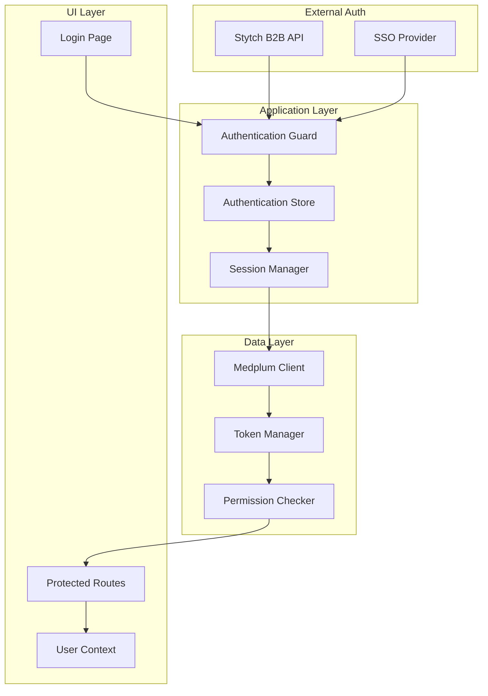
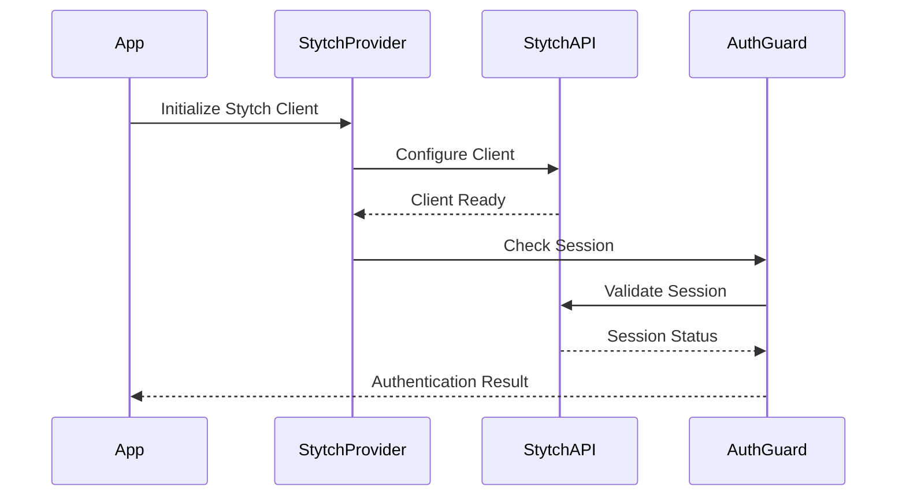
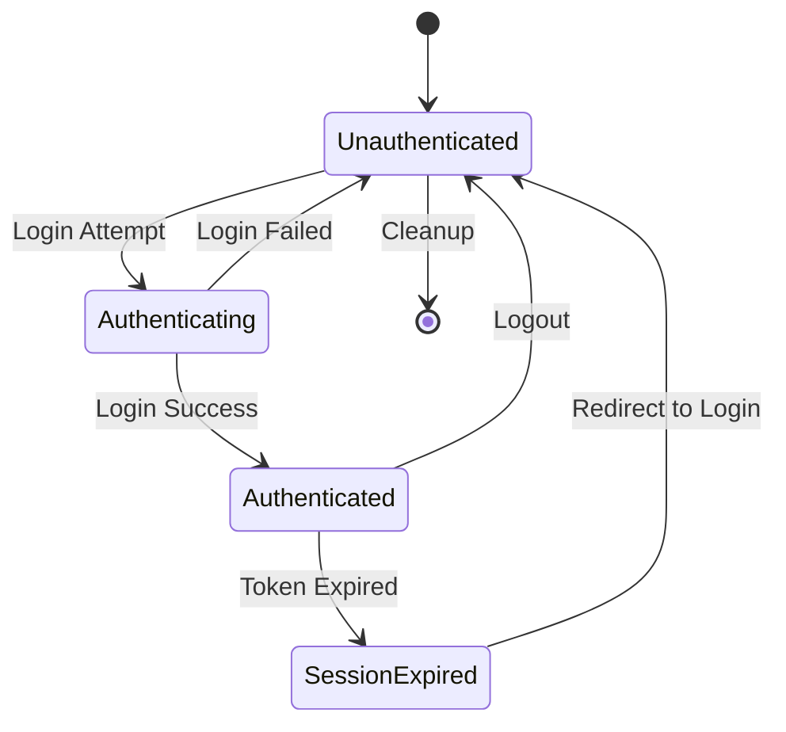
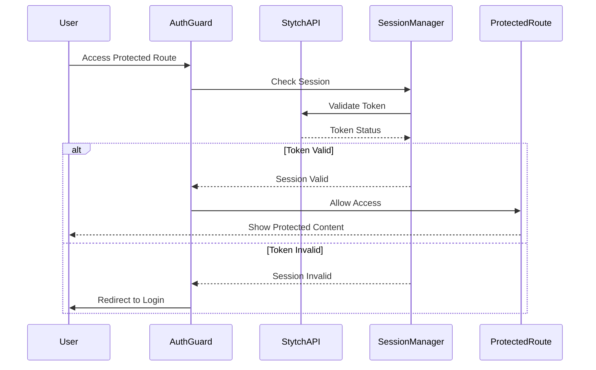
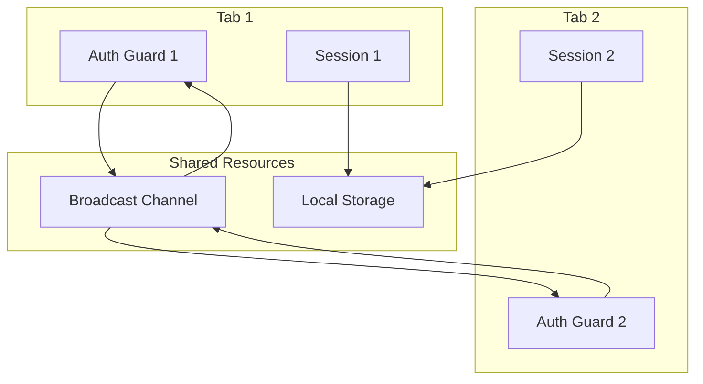
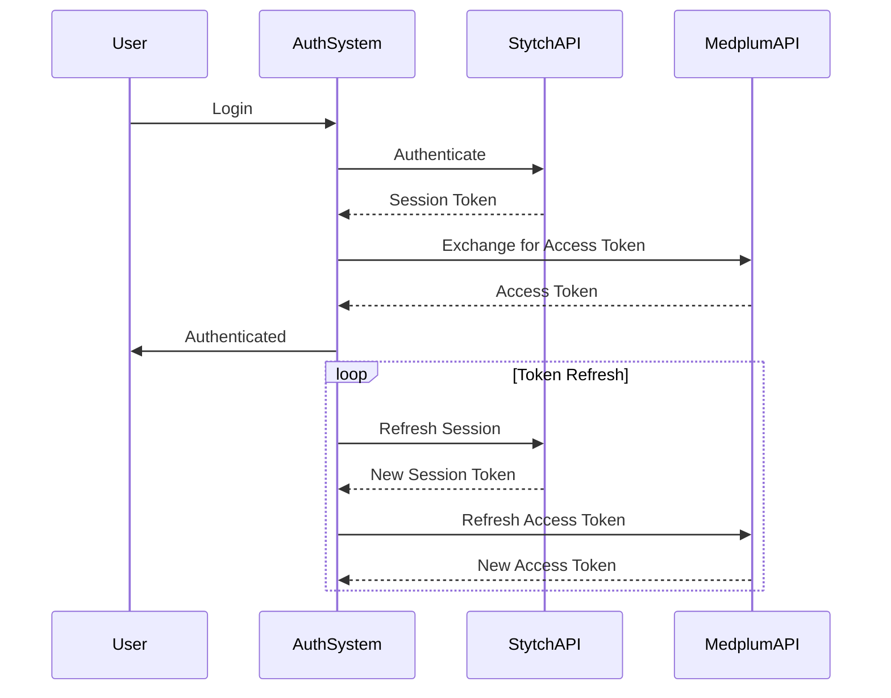
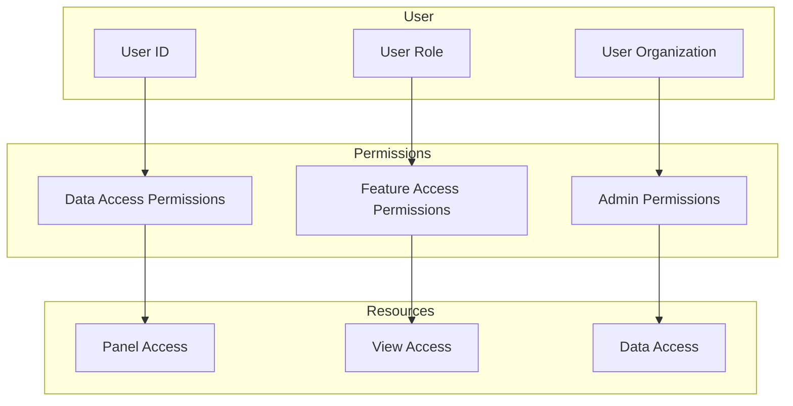

# Authentication Flow

The authentication flow is the security foundation of the Panels Management System. It ensures that only authorized users can access the application and that their sessions are properly managed across the entire system. Understanding this flow is essential for security, debugging authentication issues, and implementing proper access controls.

## Authentication Architecture

The authentication system uses a multi-layered approach to ensure security and reliability:

## Authentication Provider Setup

The application uses Stytch B2B for enterprise authentication, which provides robust security features for healthcare environments.

### Stytch Integration

### Provider Configuration

The Stytch provider is configured with:

- **Public Token**: For client-side authentication
- **Organization Settings**: Multi-tenant configuration
- **Session Management**: Token storage and refresh
- **Error Handling**: Graceful failure management

## Session Management

Session management ensures users remain authenticated throughout their interaction with the application.

### Session Lifecycle

### Session Components

Each session includes:

- **Stytch Session Token**: Primary authentication token
- **Medplum Access Token**: For data access authorization
- **User Information**: Profile and permission data
- **Organization Context**: Multi-tenant isolation
- **Session Metadata**: Creation time, expiration, etc.

### Session Storage

Sessions are stored using multiple mechanisms:

- **Cookies**: For session persistence across browser sessions
- **LocalStorage**: For token caching and multi-tab coordination
- **Memory**: For active session state
- **BroadcastChannel**: For cross-tab session synchronization

## Authentication Guard

The authentication guard protects routes and ensures users are properly authenticated before accessing protected resources.

### Guard Process

### Guard Features

- **Route Protection**: Prevents access to unauthorized routes
- **Session Validation**: Checks token validity on each request
- **Redirect Management**: Handles login redirects gracefully
- **Error Handling**: Manages authentication failures
- **Multi-tab Coordination**: Synchronizes authentication across tabs

## Multi-tab Coordination

The authentication system coordinates sessions across multiple browser tabs to ensure consistency and security.

### Coordination Mechanisms

### Benefits

- **Session Consistency**: All tabs show the same authentication state
- **Resource Efficiency**: Shared authentication tokens and sessions
- **Security**: Coordinated logout across all tabs
- **User Experience**: Seamless experience across multiple tabs

## Token Management

The system manages multiple types of tokens for different purposes and services.

### Token Types

- **Stytch Session Token**: Primary authentication token
- **Medplum Access Token**: For FHIR data access
- **Refresh Tokens**: For token renewal
- **Organization Tokens**: For multi-tenant isolation

### Token Lifecycle

### Token Security

- **Encryption**: All tokens are encrypted in storage
- **Expiration**: Tokens have appropriate expiration times
- **Rotation**: Tokens are regularly refreshed
- **Revocation**: Tokens can be revoked when needed

## Permission and Authorization

Once authenticated, the system checks permissions to determine what data and features users can access.

### Permission Model

### Authorization Checks

The system performs authorization checks at multiple levels:

- **Route Level**: Can the user access this page?
- **Component Level**: Can the user see this component?
- **Data Level**: Can the user access this data?
- **Action Level**: Can the user perform this action?

## Error Handling and Recovery

The authentication system includes comprehensive error handling to maintain security and user experience.

### Error Categories

- **Authentication Errors**: Login failures and invalid credentials
- **Session Errors**: Expired or invalid sessions
- **Token Errors**: Token validation and refresh failures
- **Permission Errors**: Insufficient access rights
- **Network Errors**: Connectivity issues with auth services

### Recovery Strategies

- **Automatic Retry**: Retry failed authentication attempts
- **Token Refresh**: Automatically refresh expired tokens
- **Graceful Degradation**: Continue operation with limited functionality
- **User Guidance**: Provide clear error messages and recovery steps

### Error States

The application handles several authentication error states:

- **Login Failed**: Invalid credentials or service unavailable
- **Session Expired**: Token has expired, redirect to login
- **Permission Denied**: User lacks required permissions
- **Service Unavailable**: Authentication service is down

## Security Considerations

The authentication system implements several security measures to protect sensitive healthcare data.

### Data Protection

- **HTTPS Only**: All authentication traffic is encrypted
- **Token Encryption**: Tokens are encrypted in storage
- **Secure Cookies**: Authentication cookies use secure flags
- **CSRF Protection**: Protection against cross-site request forgery

### Access Control

- **Multi-factor Authentication**: Support for MFA when configured
- **Session Timeout**: Automatic session expiration
- **Concurrent Session Limits**: Prevent multiple active sessions
- **Audit Logging**: Track all authentication events

### Compliance

- **HIPAA Compliance**: Meets healthcare data protection requirements
- **Audit Trails**: Complete logging of authentication events
- **Data Minimization**: Only collect necessary authentication data
- **Right to Deletion**: Support for user data deletion

## Performance Optimization

Authentication is optimized for speed and reliability:

### Performance Features

- **Token Caching**: Cache tokens to reduce API calls
- **Parallel Validation**: Validate multiple tokens simultaneously
- **Background Refresh**: Refresh tokens in the background
- **Connection Pooling**: Reuse connections to auth services

### Monitoring

The system monitors authentication performance:

- **Login Latency**: Time to complete authentication
- **Token Refresh Rate**: Frequency of token renewals
- **Error Rates**: Frequency of authentication failures
- **Session Duration**: How long users stay authenticated

## Troubleshooting Authentication Issues

Common authentication problems and their solutions:

### Login Issues

- **Invalid Credentials**: Check username/password and account status
- **Service Unavailable**: Verify Stytch service status
- **Network Problems**: Check connectivity to auth services
- **Configuration Errors**: Verify auth configuration

### Session Issues

- **Session Expired**: Clear cookies and re-authenticate
- **Token Invalid**: Refresh authentication tokens
- **Multi-tab Conflicts**: Check tab coordination
- **Permission Changes**: Verify user permissions

### Performance Issues

- **Slow Login**: Check network latency and auth service performance
- **Frequent Timeouts**: Adjust session timeout settings
- **Token Refresh Delays**: Optimize token refresh logic
- **Memory Leaks**: Check for authentication-related memory issues

## Next Steps

After understanding authentication flow, explore:

- **[Application Startup Flow](./application-startup.md)** - How authentication integrates with startup
- **[Panel Entry Flow](./panel-entry-flow.md)** - How authentication affects panel access
- **[Real-time Updates](./real-time-updates.md)** - How authentication affects update permissions
- **[State Management](./state-management.md)** - How authentication state is managed 