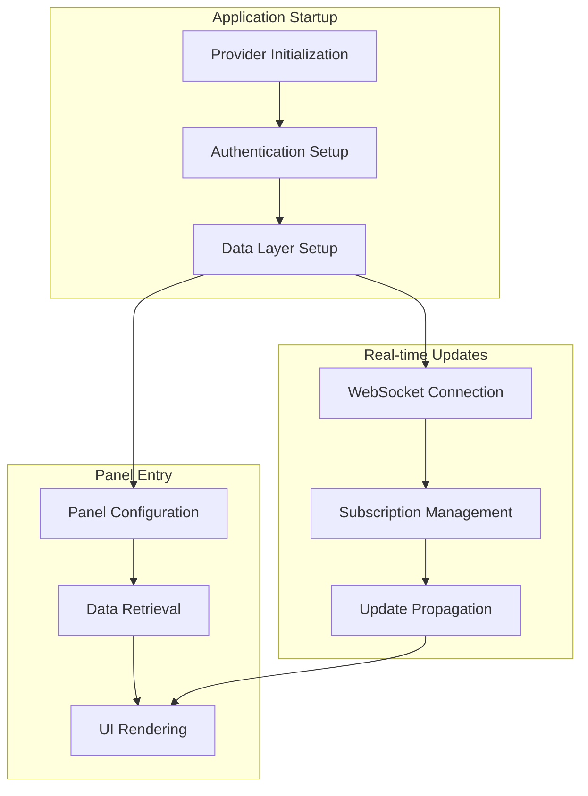

# Understanding Application Data Flow

This section explains how data flows through the Panels Management System, from application startup through real-time updates. Understanding these flows is crucial for developers working with the system, as it reveals the underlying patterns and principles that govern how data moves through the application.

## The Three Core Data Flows

The application has three primary data flow scenarios, each serving different purposes:

### 1. Application Startup Flow
When the application first loads, it must establish all necessary connections and prepare the data layer. This flow ensures the application is ready to serve users efficiently.

**[Learn about Application Startup →](./application-startup.md)**

### 2. Panel Entry Flow
When a user navigates to a specific panel, the application must load panel configuration and retrieve the relevant data from external systems. This flow optimizes for fast, responsive user experiences.

**[Learn about Panel Entry Flow →](./panel-entry-flow.md)**

### 3. Real-time Updates Flow
The application maintains live connections to external data sources to provide real-time updates. This flow ensures users see the most current information without manual refresh.

**[Learn about Real-time Updates →](./real-time-updates.md)**

## Supporting Flows

These core flows are supported by additional specialized flows:

### Authentication Flow
How the application manages user authentication and session state across the entire system.

**[Learn about Authentication Flow →](./authentication-flow.md)**

### State Management Flow
How the application manages and transforms data as it moves through different layers of the system.

**[Learn about State Management →](./state-management.md)**

## Flow Integration

These flows don't operate in isolation. They work together to create a seamless user experience:

## Common Patterns

As you explore these flows, you'll notice recurring patterns:

### Provider Pattern
Components are wrapped in providers that establish context and manage dependencies.

### Hook Pattern
Custom React hooks encapsulate data access logic and provide reactive interfaces.

### Store Pattern
Reactive stores manage application state and coordinate updates across components.

### Subscription Pattern
WebSocket subscriptions maintain live connections to external data sources.

## Troubleshooting Guide

When working with these flows, common issues include:

- **Authentication failures** - Check session validity and token expiration
- **Data loading delays** - Verify external service connectivity
- **Real-time update gaps** - Check WebSocket connection status
- **State inconsistencies** - Verify reactive store subscriptions

Each flow documentation includes specific troubleshooting guidance.

## Next Steps

Start with the **[Application Startup Flow](./application-startup.md)** to understand how the system initializes, then explore the other flows to build a complete understanding of how data moves through the application.

---

## Contributing to Data Flow Documentation

Help improve our understanding of data flows:

- **Report Issues** - Document unexpected behavior or performance problems
- **Share Insights** - Document discoveries about flow interactions
- **Suggest Improvements** - Propose optimizations or architectural changes
- **Update Diagrams** - Keep visual representations current with code changes 