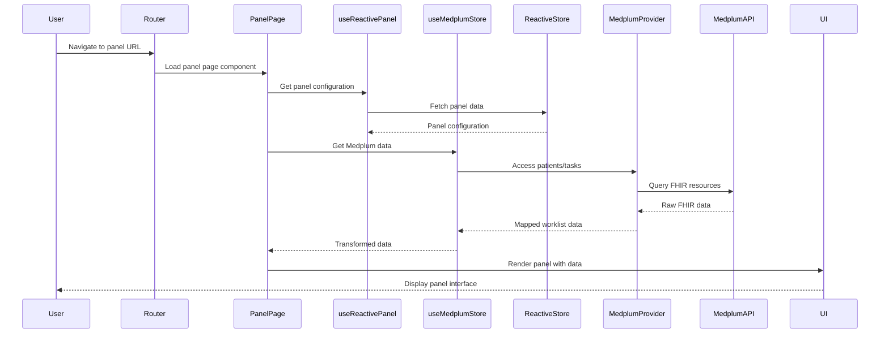
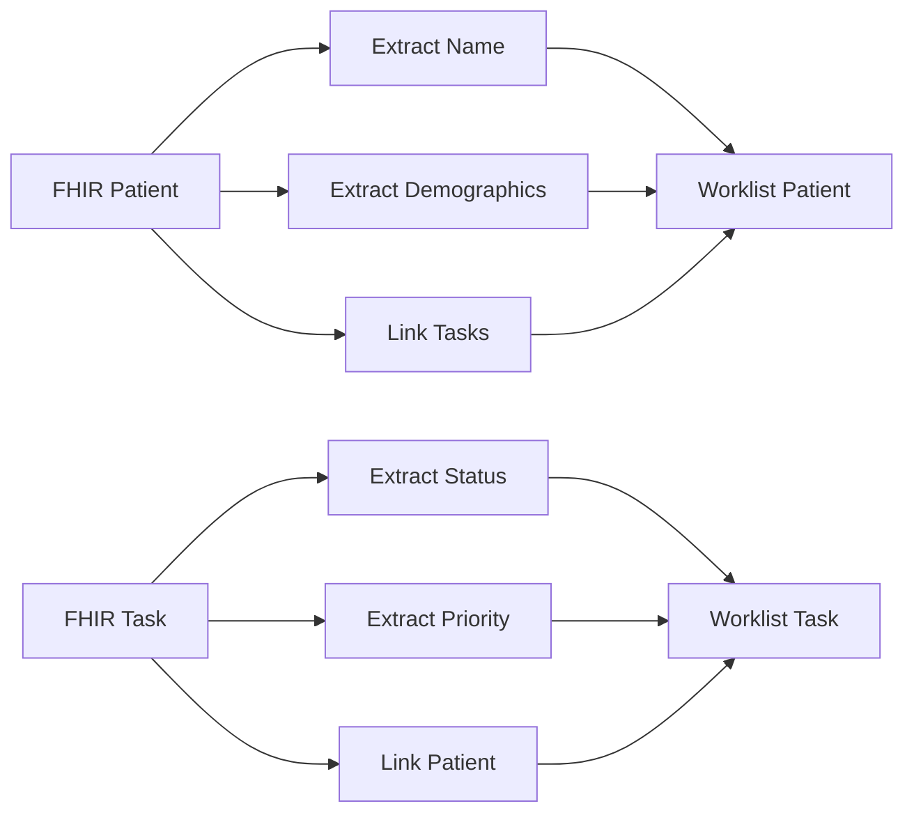
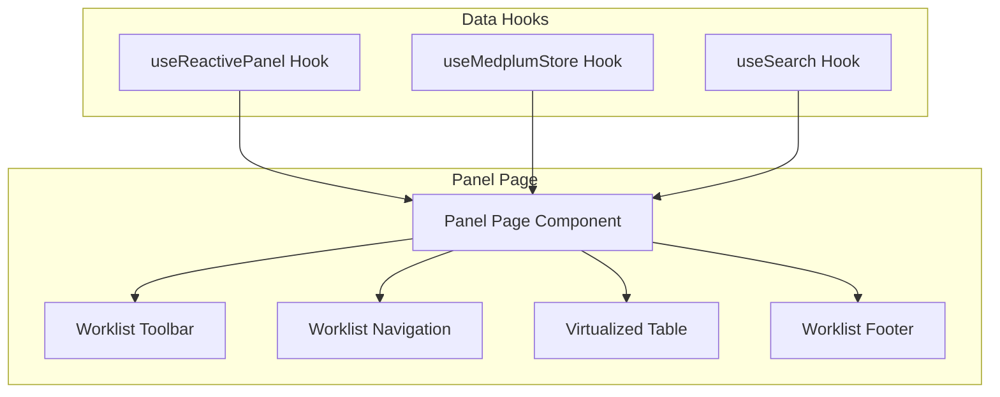

# Panel Entry Flow

The panel entry flow describes what happens when a user navigates to a specific panel in the application. This flow is critical for user experience, as it determines how quickly and reliably users can access their data. Understanding this flow helps optimize performance and debug issues related to panel loading and data display.

## Why Panel Entry Matters

Panel entry is the most common user interaction in the application. Users expect:

- **Fast loading times** - Panels should load within 1-2 seconds
- **Accurate data** - Information should be current and reliable
- **Responsive interface** - UI should update smoothly as data loads
- **Error resilience** - Graceful handling when data is unavailable
- **Consistent experience** - Similar performance across different panels

## Panel Entry Sequence Overview

When a user navigates to a panel, the application follows a specific sequence to load and display the required data:

## Panel Configuration Loading

The first step in panel entry is loading the panel's configuration, which defines how data should be displayed and filtered.

### Configuration Sources

Panel configurations can come from multiple sources:

- **Local Storage**: For development and offline scenarios
- **API Storage**: For production with backend persistence
- **Hybrid Mode**: Combines local caching with API persistence

### Configuration Components

A panel configuration includes:

- **Panel Metadata**: Title, description, and settings
- **Column Definitions**: How data should be displayed
- **Filter Configuration**: What data to include/exclude
- **View Settings**: Display preferences and layout
- **Access Permissions**: Who can view and modify the panel

### Loading Process

1. **Route Parameter Extraction**: Get panel ID from URL
2. **Store Query**: Retrieve panel from reactive store
3. **Configuration Validation**: Ensure configuration is valid
4. **Default Application**: Apply fallback settings if needed

## Data Retrieval and Transformation

Once the panel configuration is loaded, the application retrieves and transforms the relevant data from Medplum.

### Data Access Strategy

The application uses several strategies to optimize data access:

- **Cached Data**: Use previously loaded data when available
- **Selective Loading**: Only load data needed for the current panel
- **Background Refresh**: Update data in the background
- **Incremental Loading**: Load additional data as needed

### FHIR Data Retrieval

The system queries Medplum for FHIR resources:

- **Patient Resources**: Basic patient information and demographics
- **Task Resources**: Clinical tasks and their status
- **Related Resources**: Connected data like practitioners and organizations
- **Custom Extensions**: Application-specific data

### Data Transformation Process

Raw FHIR data is transformed into a worklist format:

### Transformation Benefits

- **Simplified Display**: Easier to render in UI components
- **Performance Optimization**: Reduced data transfer and processing
- **Consistent Format**: Standardized data structure across panels
- **Business Logic**: Application-specific calculations and formatting

## UI Rendering and State Management

The transformed data flows through the UI rendering system to create the final user interface.

### Component Hierarchy

### Rendering Process

1. **Data Binding**: Connect transformed data to UI components
2. **Filter Application**: Apply panel filters to data
3. **Sort Configuration**: Arrange data according to sort settings
4. **Virtualization**: Optimize rendering for large datasets
5. **Event Binding**: Connect user interactions to data operations

### State Synchronization

The UI maintains several synchronized states:

- **Loading State**: Show loading indicators during data fetch
- **Error State**: Display error messages when data is unavailable
- **Empty State**: Show appropriate messages when no data exists
- **Success State**: Display data with full functionality

## Performance Optimization

Panel entry is optimized for speed and responsiveness:

### Loading Optimizations

- **Parallel Data Loading**: Load configuration and data simultaneously
- **Caching Strategy**: Cache panel configurations and frequently accessed data
- **Lazy Loading**: Load non-critical components after initial render
- **Virtual Scrolling**: Only render visible table rows

### Data Optimization

- **Selective Queries**: Only fetch data needed for the current view
- **Pagination**: Load data in chunks for large datasets
- **Background Updates**: Update data without blocking the UI
- **Compression**: Reduce data transfer size

### UI Optimization

- **Component Memoization**: Prevent unnecessary re-renders
- **Event Debouncing**: Limit rapid user interactions
- **Progressive Enhancement**: Start with basic functionality, enhance progressively
- **Responsive Design**: Optimize for different screen sizes

## Error Handling and Recovery

Panel entry includes comprehensive error handling to ensure a good user experience:

### Error Categories

- **Configuration Errors**: Invalid or missing panel configuration
- **Data Loading Errors**: Network or service unavailability
- **Transformation Errors**: Issues with data processing
- **Rendering Errors**: UI component failures

### Recovery Strategies

- **Graceful Degradation**: Show partial data when possible
- **Retry Logic**: Automatically retry failed operations
- **Fallback Content**: Display alternative content on errors
- **User Guidance**: Provide clear error messages and recovery steps

### Error States

The application handles several error states:

- **Configuration Not Found**: Panel doesn't exist or user lacks access
- **Data Unavailable**: External services are down
- **Network Issues**: Connectivity problems
- **Permission Denied**: User lacks required permissions

## Real-time Integration

Panel entry integrates with the real-time update system to keep data current:

### Update Propagation

- **WebSocket Updates**: Real-time changes from Medplum
- **UI Synchronization**: Automatic UI updates when data changes
- **Conflict Resolution**: Handle concurrent modifications
- **Optimistic Updates**: Immediate UI feedback for user actions

### Update Strategies

- **Incremental Updates**: Only update changed data
- **Batch Processing**: Group multiple updates together
- **Priority Queuing**: Handle high-priority updates first
- **Background Processing**: Process updates without blocking UI

## Multi-view Support

The application supports different view types within panels:

### View Types

- **Patient View**: Display patient-centric information
- **Task View**: Display task-centric information
- **Custom Views**: Application-specific view types

### View Switching

- **State Preservation**: Maintain state when switching views
- **Data Sharing**: Share common data between views
- **Performance Optimization**: Optimize for view-specific data needs
- **User Preferences**: Remember user's preferred view

## Troubleshooting Panel Entry Issues

Common panel entry problems and their solutions:

### Loading Issues

- **Slow Panel Loading**: Check network latency and data size
- **Configuration Errors**: Verify panel configuration validity
- **Data Fetch Failures**: Check external service availability
- **Memory Issues**: Monitor for memory leaks in data processing

### Display Issues

- **Incorrect Data**: Verify data transformation logic
- **Missing Information**: Check filter and permission settings
- **UI Rendering Problems**: Validate component state management
- **Performance Issues**: Monitor for unnecessary re-renders

### Real-time Issues

- **Stale Data**: Check WebSocket connection status
- **Update Delays**: Verify update propagation logic
- **Conflicts**: Handle concurrent data modifications
- **Sync Problems**: Ensure data consistency across components

## Next Steps

After understanding panel entry flow, explore:

- **[Real-time Updates](./real-time-updates.md)** - How live updates work after panel entry
- **[State Management](./state-management.md)** - How reactive stores manage panel data
- **[Authentication Flow](./authentication-flow.md)** - How authentication affects panel access
- **[Application Startup Flow](./application-startup.md)** - How startup prepares for panel entry 