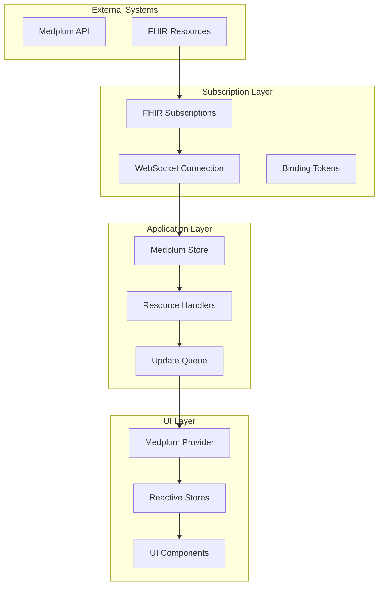
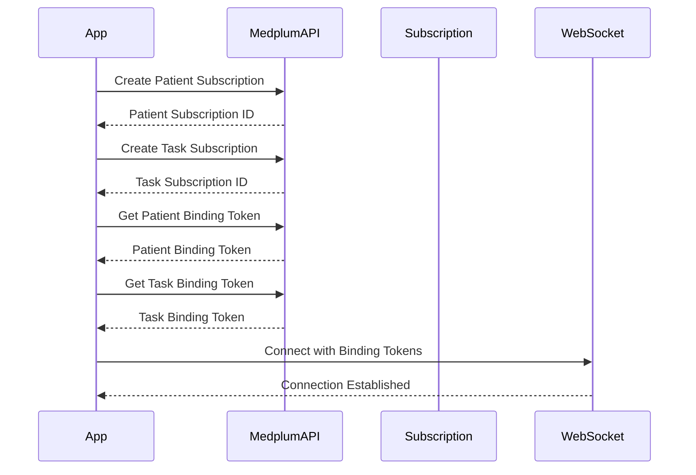
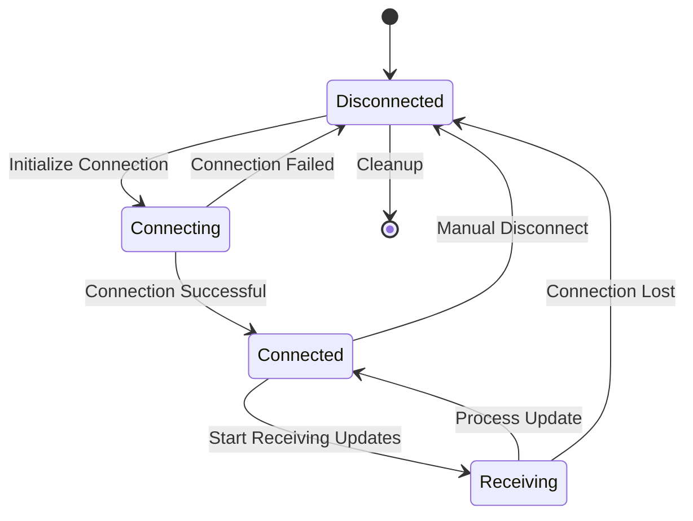
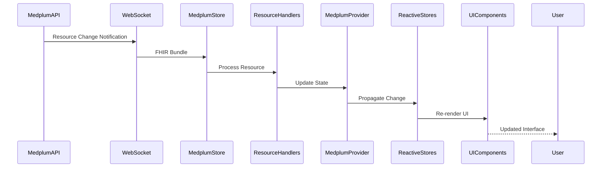
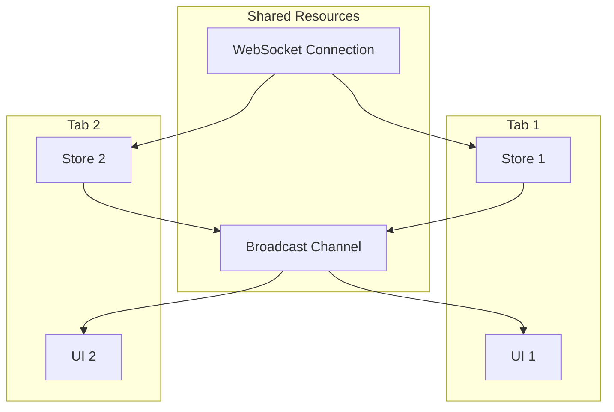

# Real-time Updates Flow

The real-time updates flow is what makes the Panels Management System feel alive and responsive. When data changes in external systems like Medplum, these changes are automatically reflected in the user interface without requiring manual refresh. Understanding this flow is crucial for maintaining data consistency and providing a seamless user experience.

## Real-time Update Architecture

The real-time update system uses a multi-layered architecture to ensure reliable and efficient updates:

## FHIR Subscription Setup

The foundation of real-time updates is the FHIR subscription system, which notifies the application when resources change.

### Subscription Creation Process

### Subscription Types

The system creates subscriptions for different resource types:

- **Patient Subscriptions**: Monitor patient demographic and clinical data changes
- **Task Subscriptions**: Track task status, assignment, and priority changes
- **Custom Resource Subscriptions**: Application-specific resource monitoring

### Subscription Configuration

Each subscription is configured with:

- **Resource Criteria**: Which resources to monitor
- **Status**: Active or inactive state
- **Channel Type**: WebSocket for real-time delivery
- **Reason**: Purpose of the subscription for audit trails

## WebSocket Connection Management

WebSocket connections provide the real-time communication channel between Medplum and the application.

### Connection Lifecycle

### Connection Features

- **Automatic Reconnection**: Handles connection drops gracefully
- **Heartbeat Monitoring**: Detects stale connections
- **Token Binding**: Associates connections with specific subscriptions
- **Error Recovery**: Reestablishes connections on failures
- **Multi-tab Coordination**: Shares connections across browser tabs

### Message Processing

WebSocket messages follow a specific format:

- **Subscription Status**: Connection health and status updates
- **Resource Bundles**: FHIR resource changes in bundle format
- **Error Messages**: Connection and subscription errors
- **Heartbeat Messages**: Keep-alive signals

## Update Propagation System

When changes occur, the system propagates updates through multiple layers to ensure all components stay synchronized.

### Update Flow

### Resource Handler System

The application uses a handler system to process different types of updates:

- **Patient Handlers**: Process patient demographic and clinical updates
- **Task Handlers**: Handle task status and assignment changes
- **Custom Handlers**: Process application-specific resource updates

### Update Processing

Each update goes through several processing steps:

1. **Validation**: Ensure the update is valid and complete
2. **Transformation**: Convert FHIR format to application format
3. **Conflict Resolution**: Handle concurrent modifications
4. **State Update**: Update application state
5. **UI Notification**: Trigger UI updates

## Multi-tab Coordination

The application coordinates updates across multiple browser tabs to ensure consistency.

### Coordination Mechanisms

### Benefits

- **Resource Efficiency**: Single WebSocket connection shared across tabs
- **Consistency**: All tabs show the same current data
- **Performance**: Reduced network overhead and processing
- **Reliability**: Better error recovery and connection management

## Error Handling and Recovery

Real-time updates include comprehensive error handling to maintain system reliability.

### Error Categories

- **Connection Errors**: WebSocket connection failures
- **Subscription Errors**: FHIR subscription issues
- **Processing Errors**: Data transformation failures
- **State Errors**: Application state inconsistencies

### Recovery Strategies

- **Automatic Reconnection**: Retry failed connections with exponential backoff
- **Subscription Refresh**: Recreate subscriptions when they become invalid
- **State Reconciliation**: Compare local state with server state
- **Graceful Degradation**: Fall back to polling when real-time updates fail

### Error Monitoring

The system monitors various error conditions:

- **Connection Health**: WebSocket connection status
- **Subscription Status**: FHIR subscription validity
- **Update Latency**: Time between change and UI update
- **Error Rates**: Frequency of update failures

## Performance Optimization

Real-time updates are optimized for performance and efficiency:

### Update Optimization

- **Incremental Updates**: Only update changed data
- **Batch Processing**: Group multiple updates together
- **Priority Queuing**: Handle high-priority updates first
- **Background Processing**: Process updates without blocking UI

### Resource Management

- **Connection Pooling**: Reuse WebSocket connections
- **Memory Management**: Clean up unused resources
- **CPU Optimization**: Efficient update processing
- **Network Optimization**: Minimize data transfer

### Caching Strategy

- **Update Cache**: Store recent updates for conflict resolution
- **State Cache**: Cache application state for quick recovery
- **Connection Cache**: Cache connection parameters for reconnection

## Conflict Resolution

When multiple updates occur simultaneously, the system resolves conflicts to maintain data consistency.

### Conflict Types

- **Concurrent Modifications**: Multiple users editing the same resource
- **Network Delays**: Updates arriving out of order
- **State Inconsistencies**: Local state differs from server state
- **Version Conflicts**: Resource version mismatches

### Resolution Strategies

- **Last-Write-Wins**: Use the most recent update
- **Merge Strategy**: Combine conflicting changes when possible
- **User Notification**: Alert users to conflicts
- **Rollback**: Revert to previous state on unresolvable conflicts

## Monitoring and Debugging

The real-time update system includes comprehensive monitoring and debugging capabilities.

### Monitoring Metrics

- **Update Latency**: Time from change to UI update
- **Connection Uptime**: WebSocket connection reliability
- **Update Volume**: Number of updates processed
- **Error Rates**: Frequency of update failures

### Debugging Tools

- **Update Logs**: Detailed logs of all updates
- **Connection Status**: Real-time connection health
- **State Inspector**: View current application state
- **Performance Profiler**: Monitor update performance

### Troubleshooting

Common real-time update issues and solutions:

- **Stale Data**: Check WebSocket connection and subscription status
- **Update Delays**: Monitor network latency and processing time
- **Missing Updates**: Verify subscription criteria and resource filters
- **Connection Drops**: Check network stability and reconnection logic

## Security Considerations

Real-time updates include security measures to protect sensitive healthcare data:

### Data Protection

- **Encryption**: All WebSocket traffic is encrypted
- **Authentication**: Updates require valid authentication tokens
- **Authorization**: Updates respect user permissions
- **Audit Logging**: Track all update activities

### Access Control

- **Resource Filtering**: Only subscribe to authorized resources
- **Update Validation**: Validate all incoming updates
- **Permission Checking**: Verify user permissions for updates
- **Data Sanitization**: Clean and validate update data

## Next Steps

After understanding real-time updates, explore:

- **[State Management](./state-management.md)** - How reactive stores handle updates
- **[Panel Entry Flow](./panel-entry-flow.md)** - How real-time updates integrate with panel loading
- **[Authentication Flow](./authentication-flow.md)** - How authentication affects update permissions
- **[Application Startup Flow](./application-startup.md)** - How startup establishes real-time connections 