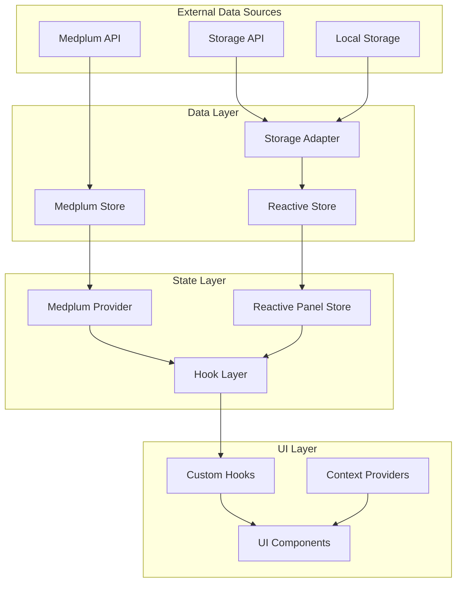
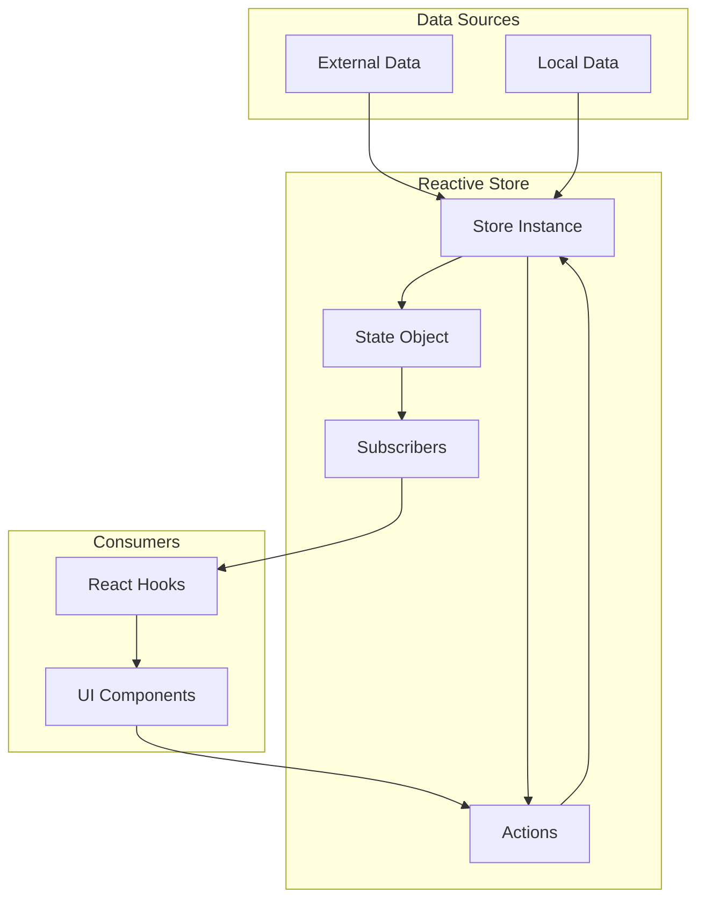
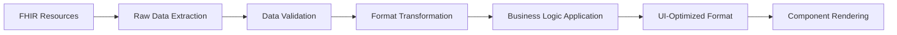
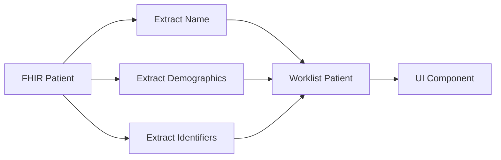
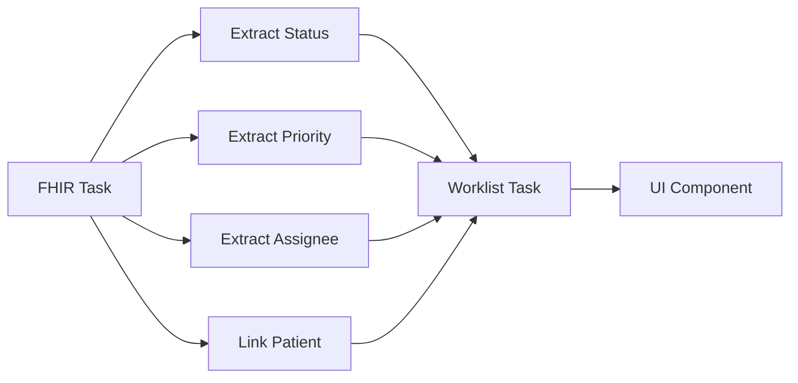
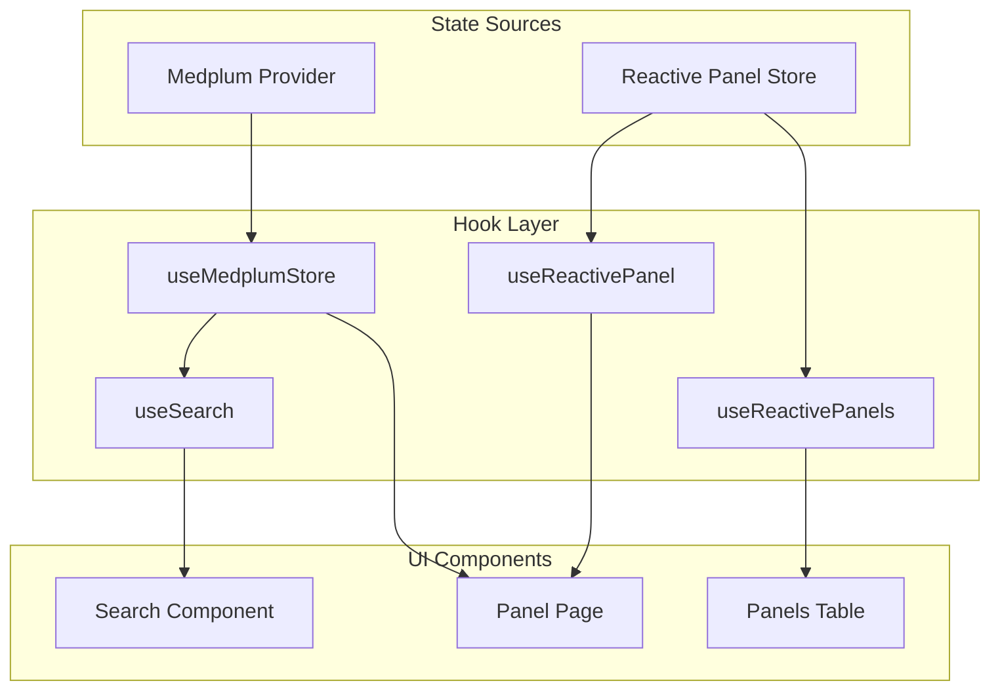
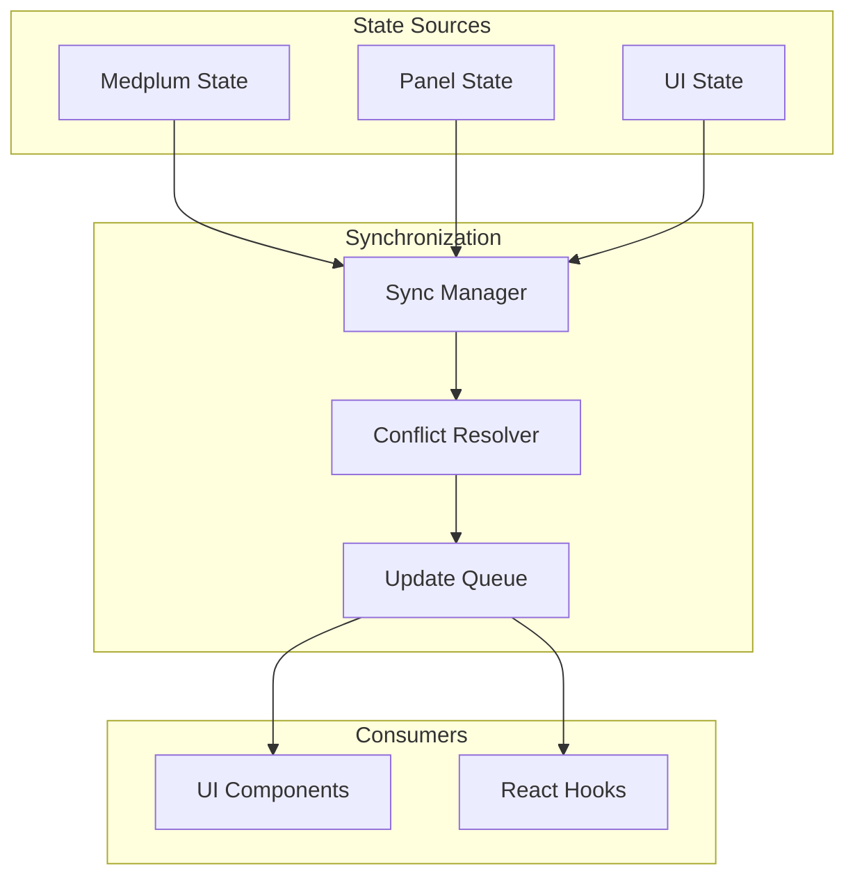
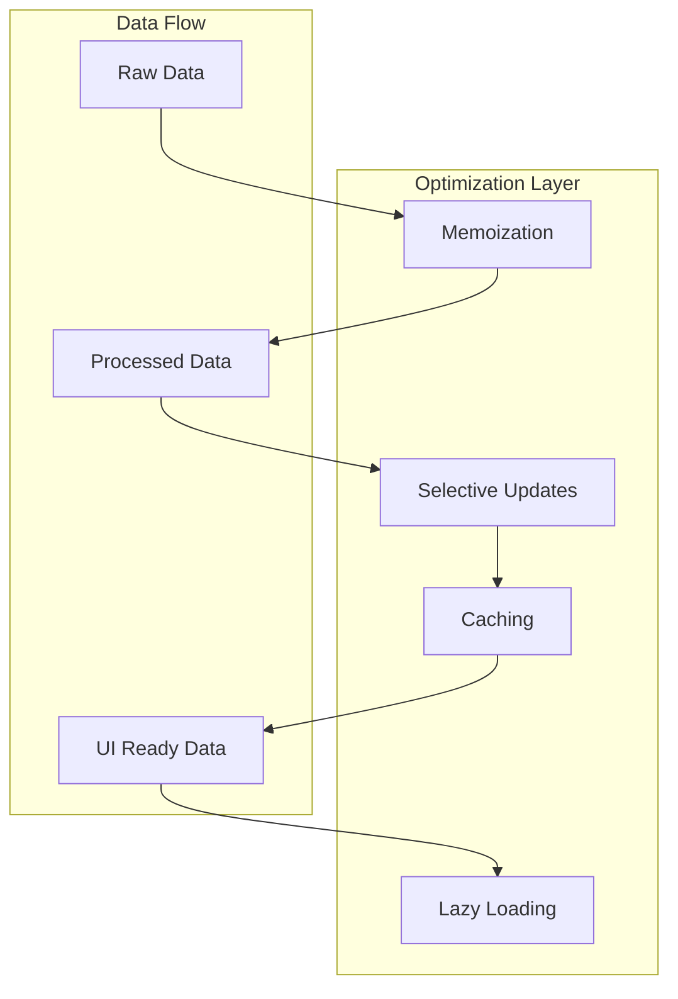
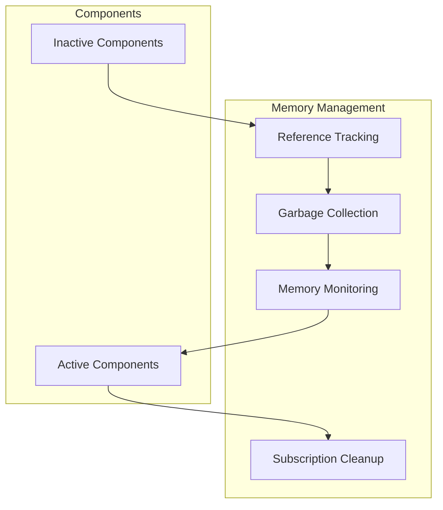
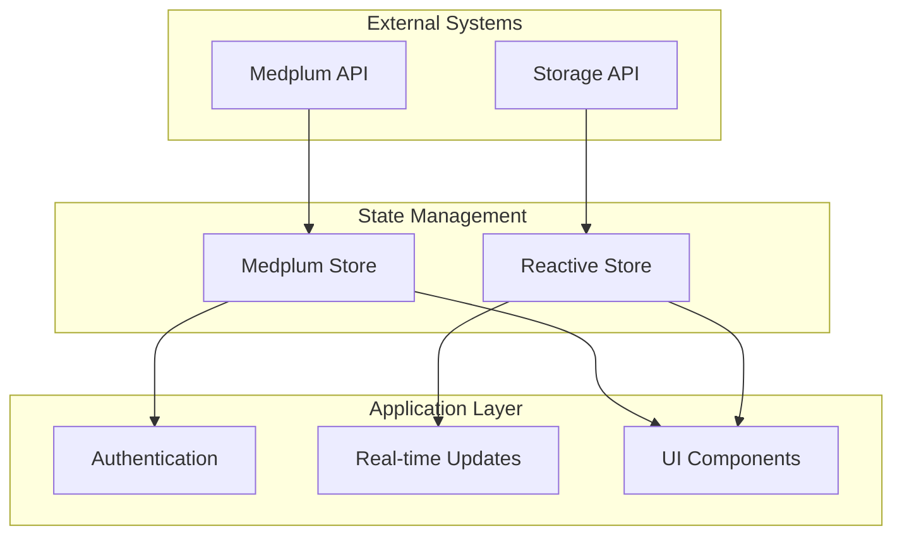

# State Management Flow

The state management flow is the backbone of the Panels Management System's data handling. It coordinates how data moves through the application, transforms between different formats, and ensures all components stay synchronized. Understanding this flow is essential for debugging data issues, optimizing performance, and extending the application with new features.

## State Management Architecture

The system uses a reactive architecture with multiple layers of state management:

## Reactive Store System

The reactive store system is the core of the state management architecture, providing automatic updates when data changes.

### Store Architecture

### Store Features

- **Reactive Updates**: Automatic UI updates when data changes
- **Subscription Management**: Efficient subscription and unsubscription
- **State Immutability**: Immutable state updates for consistency
- **Action Dispatching**: Centralized state modifications
- **Performance Optimization**: Minimal re-renders and efficient updates

## Data Transformation Pipeline

Data flows through a transformation pipeline that converts between different formats and optimizes for different use cases.

### Transformation Flow

### Transformation Stages

1. **Raw Data Extraction**: Extract relevant data from FHIR resources
2. **Data Validation**: Ensure data integrity and completeness
3. **Format Transformation**: Convert to application-specific formats
4. **Business Logic Application**: Apply business rules and calculations
5. **UI Optimization**: Optimize data for efficient rendering

### Transformation Examples

#### Patient Data Transformation

#### Task Data Transformation

## Hook Layer

The hook layer provides a clean interface between the state management system and React components.

### Hook Architecture

### Hook Features

- **Data Access**: Provide easy access to state data
- **Reactive Updates**: Automatically update when data changes
- **Error Handling**: Manage and expose error states
- **Loading States**: Handle loading and transition states
- **Optimization**: Prevent unnecessary re-renders

## State Synchronization

The system maintains consistency across multiple state sources and components.

### Synchronization Mechanisms

### Synchronization Features

- **Multi-source Coordination**: Coordinate data from multiple sources
- **Conflict Resolution**: Handle conflicting updates gracefully
- **Update Batching**: Group related updates for efficiency
- **State Reconciliation**: Ensure consistency across the application

## Performance Optimization

State management is optimized for performance and efficiency:

### Optimization Strategies

### Performance Features

- **Memoization**: Cache expensive computations
- **Selective Updates**: Only update changed data
- **Lazy Loading**: Load data on demand
- **Caching**: Cache frequently accessed data
- **Virtual Scrolling**: Optimize rendering for large datasets

## Error Handling and Recovery

The state management system includes comprehensive error handling:

### Error Categories

- **Data Loading Errors**: Failures when fetching data
- **Transformation Errors**: Issues with data processing
- **State Inconsistency Errors**: Conflicts between state sources
- **Performance Errors**: Memory leaks or excessive re-renders

### Recovery Strategies

- **Graceful Degradation**: Continue operation with partial data
- **Retry Logic**: Automatically retry failed operations
- **State Rollback**: Revert to previous stable state
- **Error Boundaries**: Isolate errors to prevent cascading failures

## Memory Management

The system carefully manages memory to prevent leaks and optimize performance:

### Memory Management Features

- **Automatic Cleanup**: Clean up unused subscriptions and listeners
- **Reference Management**: Proper handling of object references
- **Garbage Collection**: Optimize for garbage collection
- **Memory Monitoring**: Track memory usage and identify leaks

### Memory Optimization

## Debugging and Monitoring

The state management system includes tools for debugging and monitoring:

### Debugging Tools

- **State Inspector**: View current state and changes
- **Action Logger**: Track all state modifications
- **Performance Profiler**: Monitor state management performance
- **Memory Analyzer**: Identify memory leaks and optimization opportunities

### Monitoring Metrics

- **State Update Frequency**: How often state changes occur
- **Component Re-render Rate**: Frequency of component updates
- **Memory Usage**: Memory consumption patterns
- **Error Rates**: Frequency of state management errors

## Integration Patterns

The state management system integrates with other parts of the application:

### Integration Points

### Integration Features

- **Authentication Integration**: Respect user permissions and access rights
- **Real-time Integration**: Handle live updates and synchronization
- **UI Integration**: Provide reactive interfaces for components
- **External API Integration**: Coordinate with external services

## Troubleshooting State Management Issues

Common state management problems and their solutions:

### Data Issues

- **Stale Data**: Check update propagation and subscription status
- **Inconsistent State**: Verify state synchronization and conflict resolution
- **Missing Data**: Check data loading and transformation logic
- **Performance Issues**: Monitor re-render frequency and memory usage

### Debugging Steps

1. **Check State Inspector**: View current state and recent changes
2. **Review Action Logs**: Identify problematic state modifications
3. **Monitor Performance**: Check for excessive re-renders or memory usage
4. **Verify Subscriptions**: Ensure components are properly subscribed to state changes

## Next Steps

After understanding state management flow, explore:

- **[Application Startup Flow](./application-startup.md)** - How state management initializes
- **[Panel Entry Flow](./panel-entry-flow.md)** - How state management handles panel data
- **[Real-time Updates](./real-time-updates.md)** - How state management processes live updates
- **[Authentication Flow](./authentication-flow.md)** - How authentication affects state management 